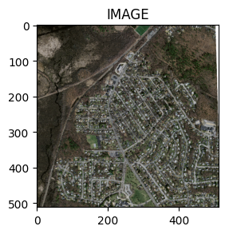
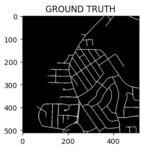
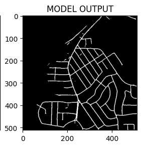

# 🛰️ Aerial Image Segmentation with PyTorch

<!-- SEO Meta Tags -->
<meta name="description" content="Aerial Image Segmentation using U-Net and PyTorch — a deep learning portfolio project that segments road networks from the Massachusetts Roads Dataset. Includes model training, evaluation, and visualization for satellite image segmentation tasks.">
<meta name="keywords" content="aerial image segmentation, satellite image segmentation, U-Net PyTorch, road extraction, Massachusetts Roads Dataset, semantic segmentation, deep learning computer vision, geospatial AI, PyTorch tutorial">


## 📘 Overview
This project demonstrates **aerial image segmentation using a U-Net architecture implemented in PyTorch**.  
It aims to accurately detect **road networks** from aerial or satellite imagery — a crucial step in **urban planning, autonomous navigation, and geospatial analysis**.

This work serves as a **portfolio project** to showcase deep learning expertise in computer vision and semantic segmentation.
<p align="center">
  
</p>

---

## 🗂️ Dataset: Massachusetts Roads Dataset
We use a subset (200 images and corresponding masks) of the **Massachusetts Roads Dataset**, containing:  
- **1171 total aerial images** of the state of Massachusetts  
- Each image: **1500 × 1500 px**, covering **~2.25 km²**  
- **Ground truth masks** for road regions  

🔗 **Full Dataset Link:** [Massachusetts Roads Dataset](https://www.cs.toronto.edu/~vmnih/data/)

```bibtex
@phdthesis{MnihThesis,
  author = {Volodymyr Mnih},
  title = {Machine Learning for Aerial Image Labeling},
  school = {University of Toronto},
  year = {2013}
}
```

---

## ⚙️ Technologies Used
- **Framework:** PyTorch  
- **Model Architecture:** U-Net (Encoder-Decoder)  
- **Data Handling:** NumPy, OpenCV, TorchVision Datasets  
- **Visualization:** Matplotlib, Seaborn  
- **Environment:** Google Colab (GPU Runtime)

---

## 🧠 Model Architecture
The project uses a **U-Net-based convolutional neural network** for pixel-level segmentation.  
U-Net’s symmetric encoder–decoder design captures both local and global context, making it ideal for **aerial and biomedical segmentation tasks**.

---

## 🚀 Setup and Usage

### 1. Clone Repository
```bash
git clone https://github.com/<your-username>/Aerial_Image_Segmentation_with_PyTorch.git
cd Aerial_Image_Segmentation_with_PyTorch
```

### 2. Install Dependencies
```bash
pip install -r requirements.txt
```

### 3. Run Notebook
```bash
jupyter notebook Aerial_Image_Segmentation_with_PyTorch.ipynb
```

### 4. Training and Evaluation
You can modify the number of epochs, learning rate, or batch size inside the notebook.

---

## 📈 Results
Model performance is evaluated on unseen aerial tiles:  
- **Metric:** Intersection over Union (IoU) and Dice Coefficient  
- **Outcome:** Clear segmentation of road networks with smooth boundaries

> *(Insert sample prediction images below)*

| Input Image | Ground Truth | Model Output |
|--------------|---------------|---------------|
|  |  |  |

---

## 🧾 Project Structure
```
Aerial_Image_Segmentation_with_PyTorch/
│
├── Aerial_Image_Segmentation_with_PyTorch.ipynb
├── README.md
├── requirements.txt
└── assets/
    ├── sample_input.png
    ├── sample_mask.png
    └── sample_output.png
```

---

## 🌟 Highlights
- Implements **U-Net** for semantic segmentation from scratch in PyTorch  
- Uses a **real-world dataset** (Massachusetts Roads)  
- Ideal for **portfolio showcasing** and **deep learning practice**  
- Easily adaptable to other segmentation tasks (buildings, rivers, etc.)

---

## 📚 Keywords for SEO
`aerial image segmentation`, `satellite image segmentation`, `road extraction`,  
`U-Net PyTorch`, `semantic segmentation`, `Massachusetts Roads Dataset`,  
`deep learning computer vision`, `geospatial AI`, `PyTorch segmentation tutorial`

---

## 🧩 Citation
If you find this repository useful, please consider citing it or starring ⭐ it on GitHub.
